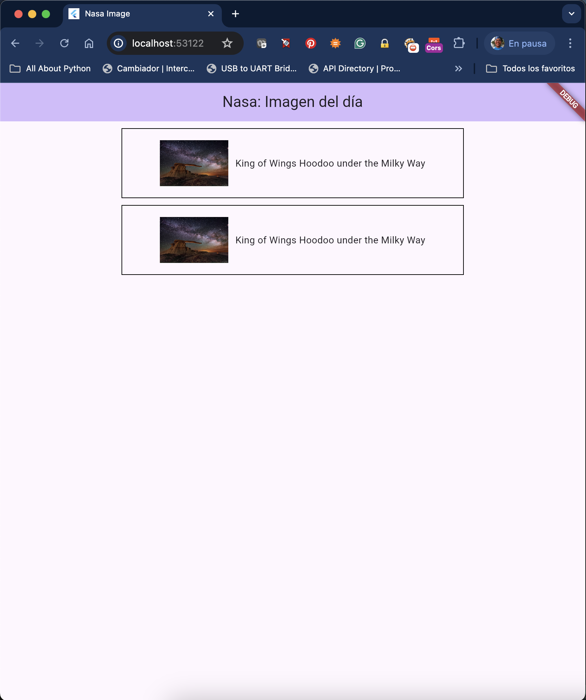

# project1

Asignacion 1.

## Aplicar los Widgets Basicos

Completar el proyecto usando los widgets basicos para 
obtener la siguiente pantalla.

[El catalogo de Widgets](https://docs.flutter.dev/ui/widgets).

